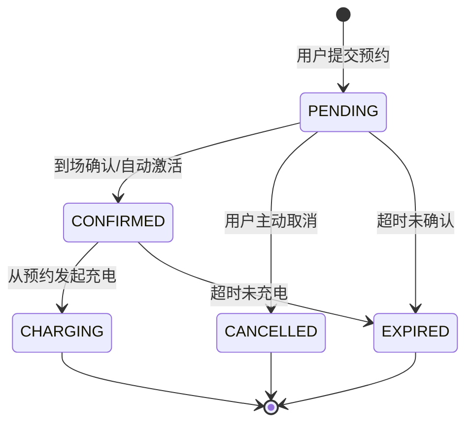
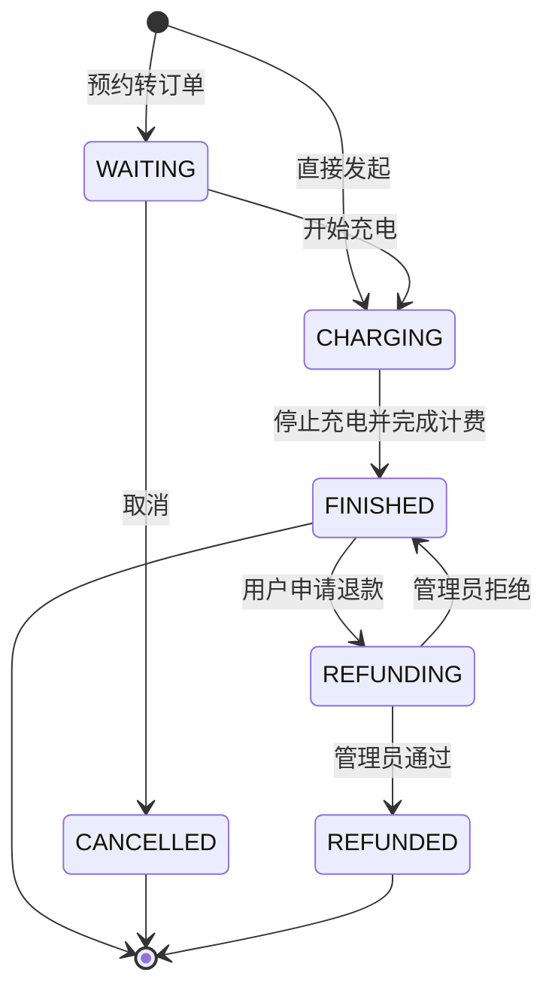
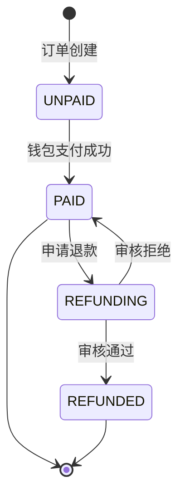
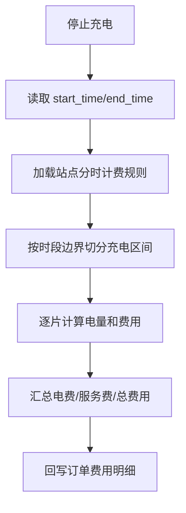

# 新能源汽车充电桩运营管理系统——关键业务流程与状态机设计

## 1. 章节定位说明（用于替代“算法设计”）

本系统属于运营管理类业务系统，核心技术价值不在复杂数学算法，而在于对业务流程的形式化建模与可执行落地。  
因此本文将“算法设计”章节替换为“关键业务流程与状态机设计”，重点说明：

- 如何通过状态机约束复杂业务流转，避免非法状态跳转；
- 如何通过分时计费规则实现可解释、可复核的费用计算；
- 如何通过定时任务与事务机制保障流程自动推进和数据一致性。

---

## 2. 业务流程设计总览

系统核心链路为：  
**查桩/预约 -> 发起充电 -> 充电结束 -> 分时计费 -> 钱包支付 -> 评价反馈 -> 运营统计**

该链路特点是状态节点多、跨模块联动强（预约、订单、支付、枪口状态、钱包流水）。  
如果仅使用普通 CRUD 处理，容易出现状态错乱、重复扣费、资源未释放等问题。因此系统采用“状态机 + 调度任务 + 事务控制”的组合方案。

---

## 3. 充电桩与充电枪状态切换逻辑

### 3.1 状态定义

系统以业务状态模拟设备状态，主要包括：

- `IDLE`：空闲，可预约、可发起充电；
- `RESERVED`：已被预约占用，等待用户到场；
- `OCCUPIED`：正在充电，不可被其他用户占用；
- `FAULT`：故障中，不可用；
- `OFFLINE`：离线/停运，不可用。

### 3.2 状态切换触发条件

| 触发事件 | 变更前 | 变更后 | 说明 |
|---|---|---|---|
| 定时任务激活预约 | IDLE | RESERVED | 预约时段开始，系统自动占用枪口 |
| 用户取消预约/预约过期 | RESERVED | IDLE | 释放资源，供其他用户使用 |
| 用户发起充电 | IDLE/RESERVED | OCCUPIED | 建立订单并占用设备 |
| 用户停止充电 | OCCUPIED | IDLE | 订单结束，设备恢复可用 |
| 用户上报故障并处理中 | 任意可用态 | FAULT | 运营商介入处理 |
| 故障修复完成 | FAULT | IDLE | 重新上线服务 |
| 运营商手动下线 | 任意状态 | OFFLINE | 维护或停运管理 |

### 3.3 设计约束

- 只有在设备处于可用状态时才允许创建充电订单；
- `OCCUPIED` 状态下禁止重复发起充电；
- `FAULT/OFFLINE` 状态下禁止预约与充电；
- 所有状态迁移在服务层统一执行，禁止前端直接指定目标状态。

上述约束确保设备状态具备“单一真相源”，避免接口绕过导致状态不一致。

---

## 4. 预约、订单、支付三类状态机设计

### 4.1 预约状态机

**设计价值**：把“预约是否还能用”从业务判断语句转化为显式状态迁移规则，便于测试和审计。

### 4.2 充电订单状态机

**设计价值**：将订单生命周期结构化，避免“已完成订单再次充电”等非法操作。

### 4.3 支付状态机

**设计价值**：支付状态与订单状态解耦管理，使财务口径更清晰，便于对账。

---

## 5. 分时计费规则处理设计（替代“核心算法”重点）

### 5.1 规则模型

每个站点配置峰/平/谷三个时段的两类单价：

- 电费单价（charge price）
- 服务费单价（service price）

计费对象不是“整单统一单价”，而是“按时间片分段计价”。

### 5.2 处理流程

### 5.3 计算口径

- 分片电量：`kwh_i = power * duration_i(hour)`
- 分片电费：`charge_fee_i = kwh_i * charge_price_i`
- 分片服务费：`service_fee_i = kwh_i * service_price_i`
- 总费用：`total_fee = Σ(charge_fee_i) + Σ(service_fee_i)`

### 5.4 该设计相比“简单算法”的优势

- 能准确处理跨峰平谷场景（如 22:30~23:30）；
- 费用构成可解释（每个时间片都可追溯）；
- 适配运营商差异化定价，支持商业策略调整。

---

## 6. 自动化流程推进：定时任务设计

系统在预约域内使用调度任务处理“时间触发型业务”：

- **每 1 分钟**：扫描进入预约时段的记录，将预约激活并设置枪口 `RESERVED`；
- **每 5 分钟**：扫描超时未确认/未充电预约，置为 `EXPIRED` 并释放枪口。

### 6.1 必要性

预约业务天然依赖时间窗口。若完全依赖用户主动操作，容易形成：
- 过期预约长期占用资源；
- 站点可用容量被虚高占用；
- 实际业务与显示状态不一致。

调度机制能保证状态按时间自动推进，提升系统自愈能力。

---

## 7. 一致性与异常处理设计

### 7.1 钱包与订单一致性

支付/退款使用事务控制，保证以下操作要么全部成功，要么全部回滚：

1. 更新订单支付状态；
2. 更新钱包余额；
3. 写入资金流水（消费/退款）。

该机制避免出现“扣款成功但订单未支付”或“退款成功但余额未回写”。

### 7.2 幂等与并发防护（论文可作为工程亮点）

- 重复停止充电：通过订单状态前置校验，避免重复计费；
- 重复支付请求：仅允许 `UNPAID -> PAID` 一次迁移；
- 预约冲突：同枪口同时间段进行冲突检测，防止一枪多约；
- 非法状态跳转：统一由服务层状态机校验并拒绝。

---

## 8. 面向论文的总结表述（可直接引用）

本系统的关键技术创新点不在复杂数值算法，而在业务流程的可计算化建模。  
通过将预约、订单、支付、设备状态抽象为有限状态机，并结合分时计费规则、调度任务与事务一致性机制，系统实现了“流程可控、费用可解释、数据可追溯、异常可恢复”的工程目标。  
该方案适用于运营管理类信息系统，具有较强的可复用性和扩展性。

---

## 9. 论文写作建议（可放“本章小结”）

如果导师强调“算法”二字，可将本章命名为：

- **业务规则算法与状态机控制策略**
- **关键业务流程控制算法设计**

这样既符合学术写作表达，也与系统实际技术重心一致。

