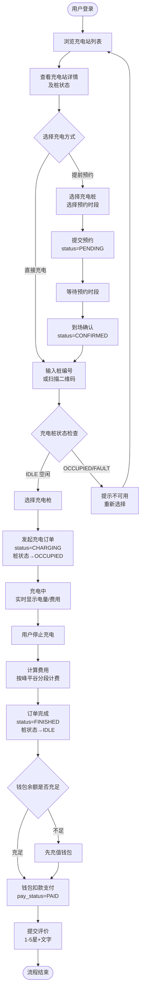
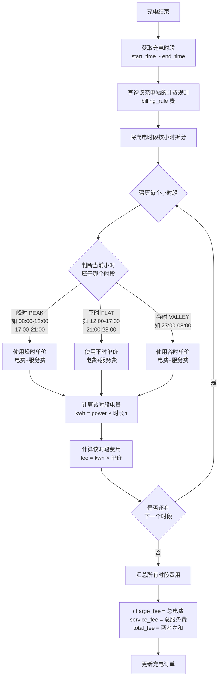
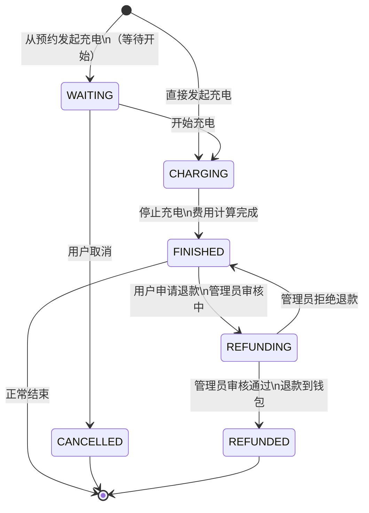
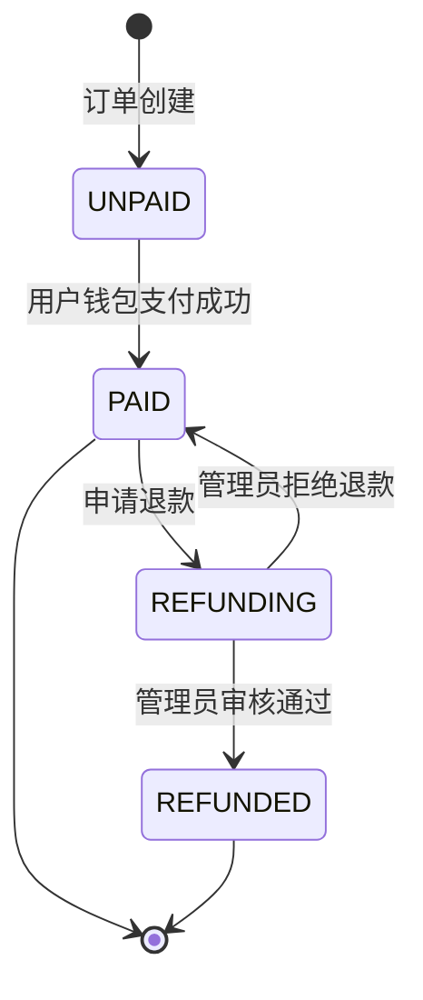
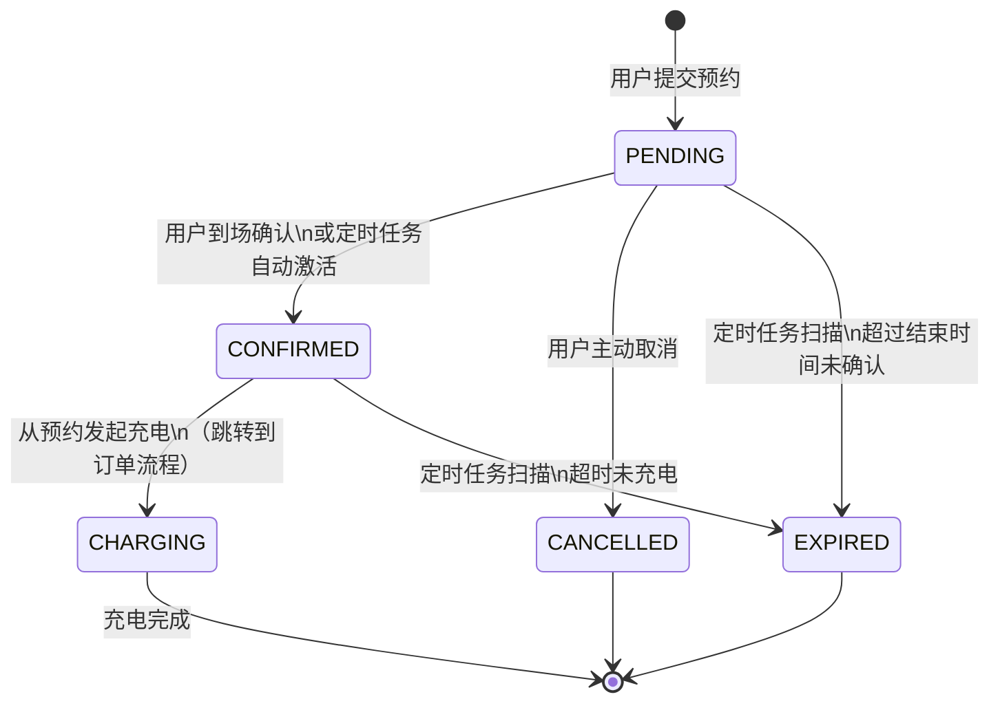

# 新能源汽车充电桩运营管理系统——功能设计文档 v2.0

---

## 一、系统概述

本系统是一套面向新能源汽车充电服务场景的纯软件业务管理平台，采用前后端分离架构，无需与真实硬件直接交互，所有充电状态与数据均由后台业务逻辑驱动。

系统覆盖充电桩日常运营全链路：
**用户注册与车辆绑定 → 查桩与预约 → 发起充电（模拟）→ 实时计费 → 订单结算与钱包支付 → 评价反馈 → 运营统计报表**

---

## 二、用户角色说明

| 角色 | 标识 | 说明 | 主要权限范围 |
|------|------|------|-------------|
| 普通用户（车主） | USER | 注册登录后使用充电服务的终端用户 | 查找充电站/桩、预约、发起充电、查看订单、支付、评价、故障上报 |
| 站点运营商 | OPERATOR | 负责管理其名下充电站点和充电桩的商户 | 充电桩 CRUD、站点管理、计费规则配置、订单查看、收益统计、故障处理 |
| 超级管理员 | ADMIN | 平台级管理者 | 用户管理、运营商管理、全平台数据统计、退款审核、公告发布、操作日志 |

---

## 三、系统功能模块总览

```mermaid
graph TB
    ROOT[充电桩运营管理系统]

    ROOT --> M1[认证模块]
    ROOT --> M2[用户中心]
    ROOT --> M3[充电站/桩查询]
    ROOT --> M4[预约模块]
    ROOT --> M5[充电订单模块]
    ROOT --> M6[计费模块]
    ROOT --> M7[运营商管理]
    ROOT --> M8[管理员后台]
    ROOT --> M9[报表统计]
    ROOT --> M10[评价模块]
    ROOT --> M11[故障管理]
    ROOT --> M12[公告模块]

    M1 --> M1A[注册]
    M1 --> M1B[登录/JWT认证]
    M1 --> M1C[忘记密码/邮箱验证]

    M2 --> M2A[个人信息管理]
    M2 --> M2B[车辆管理]
    M2 --> M2C[钱包充值/流水]

    M3 --> M3A[充电站列表/详情]
    M3 --> M3B[充电桩状态查询]
    M3 --> M3C[计费规则查询]

    M4 --> M4A[发起预约]
    M4 --> M4B[我的预约]
    M4 --> M4C[取消/确认预约]
    M4 --> M4D[从预约发起充电]

    M5 --> M5A[发起充电]
    M5 --> M5B[充电中查询]
    M5 --> M5C[停止充电]
    M5 --> M5D[订单支付]
    M5 --> M5E[申请退款]

    M6 --> M6A[峰平谷时段配置]
    M6 --> M6B[分段计费计算]

    M7 --> M7A[充电站CRUD]
    M7 --> M7B[充电桩CRUD]
    M7 --> M7C[充电枪管理]
    M7 --> M7D[计费规则配置]
    M7 --> M7E[订单查看]
    M7 --> M7F[收益统计]

    M8 --> M8A[用户管理]
    M8 --> M8B[运营商管理]
    M8 --> M8C[退款审核]
    M8 --> M8D[公告管理]
    M8 --> M8E[操作日志]
    M8 --> M8F[仪表盘统计]

    M9 --> M9A[订单量趋势]
    M9 --> M9B[收入汇总]
    M9 --> M9C[充电桩利用率]
    M9 --> M9D[Excel导出]
```

---

## 四、三角色功能矩阵

| 功能模块 | 功能点 | 普通用户 | 运营商 | 管理员 |
|----------|--------|:--------:|:------:|:------:|
| **认证** | 注册/登录/忘记密码 | ✓ | ✓ | ✓ |
| **个人信息** | 查看/修改个人资料 | ✓ | ✓ | ✓ |
| **个人信息** | 修改密码 | ✓ | ✓ | ✓ |
| **车辆管理** | 添加/查看/删除车辆 | ✓ | — | — |
| **钱包** | 查看余额/充值/流水 | ✓ | — | — |
| **充电站查询** | 站点列表/详情 | ✓ | ✓ | ✓ |
| **充电桩查询** | 桩状态/计费规则 | ✓ | ✓ | ✓ |
| **预约** | 发起/取消/确认预约 | ✓ | — | — |
| **充电订单** | 发起/停止充电 | ✓ | — | — |
| **充电订单** | 支付/申请退款 | ✓ | — | — |
| **充电订单** | 查看我的订单 | ✓ | — | — |
| **评价** | 提交评价 | ✓ | — | — |
| **评价** | 回复评价 | — | ✓ | — |
| **评价** | 屏蔽评价 | — | — | ✓ |
| **故障** | 上报故障 | ✓ | — | — |
| **故障** | 处理故障 | — | ✓ | — |
| **故障** | 查看全部故障 | — | — | ✓ |
| **充电站管理** | 站点 CRUD | — | ✓ | — |
| **充电桩管理** | 桩/枪 CRUD | — | ✓ | — |
| **计费规则** | 配置峰平谷规则 | — | ✓ | — |
| **运营商订单** | 查看名下订单 | — | ✓ | — |
| **收益统计** | 收入/利用率报表 | — | ✓ | ✓ |
| **用户管理** | 用户列表/启禁用 | — | — | ✓ |
| **退款审核** | 审核退款申请 | — | — | ✓ |
| **公告管理** | 发布/下线公告 | — | — | ✓ |
| **操作日志** | 查看系统日志 | — | — | ✓ |
| **仪表盘** | 全平台数据统计 | — | — | ✓ |

---

## 五、核心业务流程图

### 5.1 用户充电完整流程

### 5.2 计费逻辑流程

### 5.3 充电订单状态机

### 5.4 支付状态机

### 5.5 预约状态机

### 5.6 故障处理流程

---

## 六、各功能模块详细说明

### 6.1 认证模块

| 功能 | 说明 |
|------|------|
| 用户注册 | 填写用户名、手机号、邮箱、密码，密码 BCrypt 加密存储，注册成功自动创建钱包 |
| 用户登录 | 用户名+密码登录，校验通过后返回 JWT Token（有效期 24 小时） |
| 忘记密码 | 输入邮箱，系统发送 6 位验证码（Redis 缓存，TTL 5 分钟） |
| 重置密码 | 输入邮箱+验证码+新密码，校验通过后更新密码 |

### 6.2 用户中心模块

| 功能 | 说明 |
|------|------|
| 查看个人信息 | 返回当前登录用户的基本信息（用户名、昵称、手机号、邮箱、角色） |
| 修改个人资料 | 可修改昵称、头像、手机号、邮箱 |
| 修改密码 | 需验证旧密码，输入新密码后更新 |
| 车辆管理 | 添加车辆（车牌号、品牌、型号、电池容量）、查看列表、删除车辆 |
| 钱包查看 | 查看当前余额、累计充值、累计消费 |
| 钱包充值 | 输入充值金额，余额增加，记录 RECHARGE 流水 |
| 流水记录 | 分页查看所有充值/消费/退款流水，支持类型筛选 |

### 6.3 充电站/桩查询模块

| 功能 | 说明 |
|------|------|
| 充电站列表 | 支持按城市、关键词筛选，分页返回，包含桩数量统计 |
| 充电站详情 | 返回站点基本信息、地理位置、营业时间、停车费说明 |
| 站内桩状态 | 返回该站点所有充电桩及充电枪的实时状态 |
| 计费规则查询 | 返回指定充电站的峰/平/谷时段计费规则 |

### 6.4 预约模块

| 功能 | 说明 |
|------|------|
| 发起预约 | 选择充电桩、预约日期和时段，校验时段不冲突后创建预约 |
| 我的预约 | 分页查看个人预约记录，支持状态筛选 |
| 取消预约 | 仅 PENDING 状态可取消，释放充电枪 RESERVED 状态 |
| 确认到场 | 用户到达充电站后确认，status → CONFIRMED |
| 从预约发起充电 | CONFIRMED 状态的预约可直接发起充电订单 |
| 定时激活 | 每 1 分钟扫描进入时段的预约，自动将充电枪置为 RESERVED |
| 超时处理 | 每 5 分钟扫描超时预约，自动置为 EXPIRED，释放充电枪 |

### 6.5 充电订单模块

| 功能 | 说明 |
|------|------|
| 发起充电 | 输入桩编号，选择充电枪，创建订单，充电桩/枪状态 → OCCUPIED |
| 查询进行中订单 | 返回当前 CHARGING 状态的订单，含实时电量和预估费用 |
| 停止充电 | 结束充电，计算电量和费用，订单 status → FINISHED |
| 订单详情 | 返回订单完整信息（时间、电量、费用明细） |
| 我的订单列表 | 分页查看历史订单，支持状态筛选 |
| 订单支付 | 钱包余额扣款，pay_status → PAID，记录 CONSUME 流水 |
| 申请退款 | PAID 状态订单可申请退款，status → REFUNDING，等待管理员审核 |

### 6.6 运营商管理模块

| 功能 | 说明 |
|------|------|
| 充电站 CRUD | 创建/修改/删除/查询名下充电站，支持地理位置配置 |
| 充电桩 CRUD | 创建/修改/删除/查询充电桩，设置桩类型（快/慢充）和功率 |
| 充电桩状态管理 | 手动设置充电桩状态（IDLE/FAULT/OFFLINE） |
| 充电枪管理 | 添加/修改/删除充电枪，设置枪类型（AC/DC）和功率 |
| 计费规则配置 | 为充电站配置峰/平/谷时段的电费和服务费单价 |
| 订单查看 | 分页查看名下所有充电订单，支持多条件筛选 |
| 收益统计 | 按日/周/月统计充电收入、订单量、电量 |
| 评价回复 | 查看用户评价，填写运营商回复 |
| 故障处理 | 查看故障上报，更新处理状态和处理备注 |

### 6.7 管理员后台模块

| 功能 | 说明 |
|------|------|
| 用户列表 | 分页查看所有用户，支持关键词搜索 |
| 用户启禁用 | 启用/禁用用户账号，禁用后无法登录 |
| 运营商列表 | 查看所有运营商账号及其站点数量 |
| 退款审核 | 查看退款申请列表，审核通过/拒绝，通过后自动退款到钱包 |
| 公告管理 | 创建/修改/上线/下线系统公告（通知/维护/活动三类） |
| 操作日志 | 查看系统操作审计日志，支持按操作人、时间范围筛选 |
| 仪表盘 | 展示全平台关键指标：用户总数、订单总数、今日收入、充电桩总数 |
| 全平台订单 | 查看全平台所有订单，支持多条件筛选 |
| 评价管理 | 查看全部评价，可屏蔽不当评价 |
| 故障列表 | 查看全平台故障记录 |

### 6.8 报表统计模块

| 功能 | 说明 |
|------|------|
| 订单量趋势 | 按日/周/月统计订单数量趋势，ECharts 折线图展示 |
| 收入汇总 | 按时间维度统计电费、服务费、总收入 |
| 充电桩利用率 | 统计各充电桩的使用时长占比 |
| Excel 导出 | 将报表数据导出为 Excel 文件（Apache POI 实现） |
| 用户增长分析 | 管理员专属，统计用户注册增长趋势 |
| 故障分析 | 管理员专属，统计故障类型分布和处理效率 |

### 6.9 评价模块

| 功能 | 说明 |
|------|------|
| 提交评价 | 充电完成后对充电站进行 1~5 星评分和文字评价，一单一评 |
| 查看评价 | 用户查看自己的评价历史；运营商查看名下站点的评价 |
| 运营商回复 | 运营商可对评价进行文字回复 |
| 屏蔽评价 | 管理员可屏蔽不当评价（is_hidden=1），屏蔽后前端不展示 |

### 6.10 公告模块

| 功能 | 说明 |
|------|------|
| 公告列表 | 公开接口，返回所有 ONLINE 状态的公告，支持类型筛选 |
| 公告详情 | 返回公告完整内容 |
| 发布公告 | 管理员创建公告（标题、内容、类型），默认 ONLINE |
| 下线公告 | 管理员将公告状态改为 OFFLINE，前端不再展示 |

---

## 七、系统非功能性设计

### 7.1 安全设计

- **认证**：JWT 无状态认证，Token 有效期 24 小时，HS384 签名算法
- **授权**：Spring Security 基于角色的访问控制（RBAC），三角色接口隔离
- **密码安全**：BCrypt 加密存储，不可逆
- **CORS**：仅允许指定前端域名跨域访问
- **操作审计**：AOP 切面自动记录关键操作日志

### 7.2 数据设计

- **逻辑删除**：所有业务表使用 `deleted` 字段软删除，数据可追溯
- **自动填充**：`create_time` / `update_time` 由 MyBatis-Plus 自动填充
- **分页查询**：所有列表接口均支持分页，使用 MyBatis-Plus 分页插件
- **统一响应**：所有接口返回统一格式 `{ code, message, data }`

### 7.3 业务设计亮点

- **峰谷计费**：充电费用按峰/平/谷时段分段精确计算，支持运营商自定义单价
- **预约定时任务**：Spring `@Scheduled` 实现预约自动激活和超时处理
- **钱包事务**：支付和退款操作使用 `@Transactional` 保证数据一致性
- **无硬件依赖**：充电桩状态完全由业务逻辑管理，支持完整模拟充电流程
