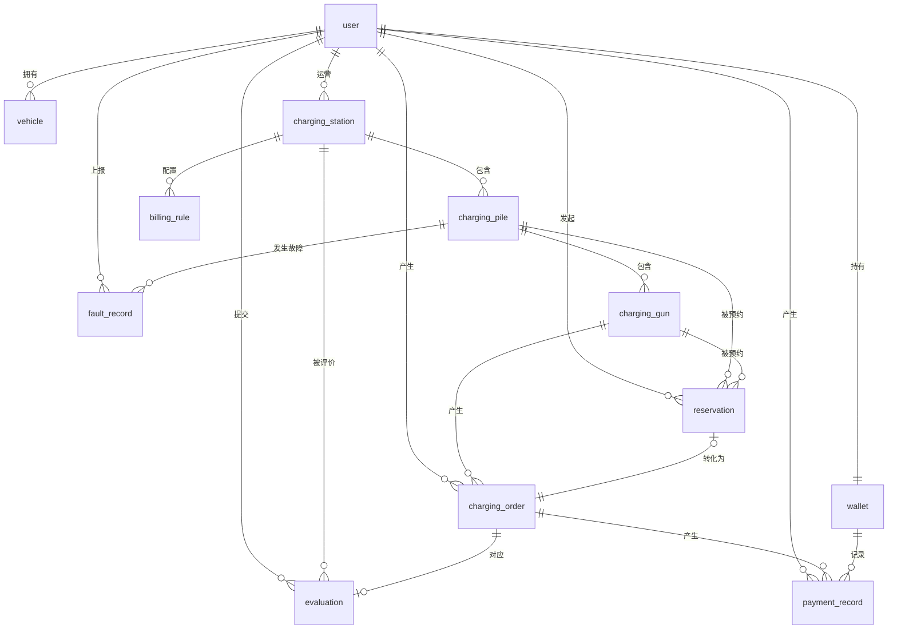

# 新能源汽车充电桩运营管理系统——数据库设计文档

---

## 一、数据库概述

- **数据库名**：`charging_db`
- **字符集**：`utf8mb4`，排序规则 `utf8mb4_unicode_ci`
- **数据库引擎**：InnoDB（全部表）
- **表数量**：14 张业务表
- **设计原则**：逻辑删除（`deleted` 字段）、自动填充时间（`create_time` / `update_time`）、MyBatis-Plus 统一管理

---

## 二、ER 关系图



---

## 三、表结构详细说明

### 3.1 用户表 `user`

> 系统核心表，通过 `role` 字段区分三类角色（USER/OPERATOR/ADMIN）

| 字段名 | 类型 | 约束 | 说明 |
|--------|------|------|------|
| id | BIGINT | PK, AUTO_INCREMENT | 主键 |
| username | VARCHAR(50) | NOT NULL, UNIQUE | 用户名 |
| phone | VARCHAR(20) | NOT NULL, UNIQUE | 手机号 |
| email | VARCHAR(100) | NULL | 邮箱（用于忘记密码验证） |
| password | VARCHAR(100) | NOT NULL | BCrypt 加密密码 |
| role | VARCHAR(20) | NOT NULL, DEFAULT 'USER' | 角色：USER / OPERATOR / ADMIN |
| nickname | VARCHAR(50) | NULL | 昵称 |
| avatar | VARCHAR(200) | NULL | 头像路径 |
| status | TINYINT | NOT NULL, DEFAULT 1 | 状态：1启用 / 0禁用 |
| deleted | TINYINT | NOT NULL, DEFAULT 0 | 逻辑删除：0正常 / 1删除 |
| create_time | DATETIME | NOT NULL | 注册时间（自动填充） |
| update_time | DATETIME | NOT NULL | 更新时间（自动更新） |

**索引：**
- `uk_username`：唯一索引，用户名
- `uk_phone`：唯一索引，手机号

---

### 3.2 车辆表 `vehicle`

> 用户绑定的新能源车辆信息

| 字段名 | 类型 | 约束 | 说明 |
|--------|------|------|------|
| id | BIGINT | PK, AUTO_INCREMENT | 主键 |
| user_id | BIGINT | NOT NULL | 所属用户 ID（外键关联 user.id） |
| plate_no | VARCHAR(20) | NOT NULL | 车牌号 |
| brand | VARCHAR(50) | NULL | 品牌（如：特斯拉、比亚迪） |
| model | VARCHAR(50) | NULL | 型号（如：Model 3、汉 EV） |
| battery_cap | DECIMAL(6,1) | NULL | 电池容量（kWh） |
| deleted | TINYINT | NOT NULL, DEFAULT 0 | 逻辑删除 |
| create_time | DATETIME | NOT NULL | 创建时间 |
| update_time | DATETIME | NOT NULL | 更新时间 |

**索引：**
- `idx_user_id`：普通索引，按用户查询车辆

---

### 3.3 充电站表 `charging_station`

> 充电站地理位置与运营信息

| 字段名 | 类型 | 约束 | 说明 |
|--------|------|------|------|
| id | BIGINT | PK, AUTO_INCREMENT | 主键 |
| operator_id | BIGINT | NOT NULL | 运营商用户 ID（外键关联 user.id） |
| name | VARCHAR(100) | NOT NULL | 充电站名称 |
| address | VARCHAR(200) | NOT NULL | 详细地址 |
| city | VARCHAR(50) | NULL | 城市 |
| longitude | DECIMAL(10,7) | NULL | 经度（精确到小数点后7位） |
| latitude | DECIMAL(10,7) | NULL | 纬度（精确到小数点后7位） |
| business_hours | VARCHAR(50) | NULL | 营业时间（如：08:00-22:00） |
| parking_fee | VARCHAR(200) | NULL | 停车费说明 |
| contact_phone | VARCHAR(20) | NULL | 联系电话 |
| description | VARCHAR(500) | NULL | 站点描述 |
| status | VARCHAR(20) | NOT NULL, DEFAULT 'ONLINE' | 状态：ONLINE / OFFLINE |
| deleted | TINYINT | NOT NULL, DEFAULT 0 | 逻辑删除 |
| create_time | DATETIME | NOT NULL | 创建时间 |
| update_time | DATETIME | NOT NULL | 更新时间 |

**索引：**
- `idx_operator_id`：按运营商查询站点
- `idx_city`：按城市筛选站点

---

### 3.4 充电桩表 `charging_pile`

> 充电桩设备信息，归属于充电站

| 字段名 | 类型 | 约束 | 说明 |
|--------|------|------|------|
| id | BIGINT | PK, AUTO_INCREMENT | 主键 |
| pile_no | VARCHAR(30) | NOT NULL, UNIQUE | 桩编号（用户扫码/输入发起充电） |
| station_id | BIGINT | NOT NULL | 所属充电站 ID |
| operator_id | BIGINT | NOT NULL | 归属运营商用户 ID |
| pile_type | VARCHAR(10) | NOT NULL | 桩类型：SLOW（慢充）/ FAST（快充） |
| power | DECIMAL(5,1) | NOT NULL, DEFAULT 7.0 | 额定功率（kW） |
| status | VARCHAR(20) | NOT NULL, DEFAULT 'IDLE' | 状态：IDLE / OCCUPIED / FAULT / OFFLINE |
| deleted | TINYINT | NOT NULL, DEFAULT 0 | 逻辑删除 |
| create_time | DATETIME | NOT NULL | 创建时间 |
| update_time | DATETIME | NOT NULL | 更新时间 |

**索引：**
- `uk_pile_no`：唯一索引，桩编号
- `idx_station_id`：按站点查询充电桩
- `idx_operator_id`：按运营商查询充电桩

**状态说明：**

| 状态值 | 含义 |
|--------|------|
| IDLE | 空闲，可使用 |
| OCCUPIED | 占用中（充电中） |
| FAULT | 故障，不可使用 |
| OFFLINE | 下线，维护中 |

---

### 3.5 充电枪表 `charging_gun`

> 充电桩下的充电枪（一桩可有多枪，通常 A/B 两枪）

| 字段名 | 类型 | 约束 | 说明 |
|--------|------|------|------|
| id | BIGINT | PK, AUTO_INCREMENT | 主键 |
| pile_id | BIGINT | NOT NULL | 所属充电桩 ID |
| gun_no | VARCHAR(10) | NOT NULL | 枪口编号（A / B） |
| gun_type | VARCHAR(10) | NOT NULL | 枪类型：AC（交流）/ DC（直流） |
| power | DECIMAL(5,1) | NULL | 额定功率（kW） |
| status | VARCHAR(20) | NOT NULL, DEFAULT 'IDLE' | 状态：IDLE / OCCUPIED / FAULT / RESERVED |
| deleted | TINYINT | NOT NULL, DEFAULT 0 | 逻辑删除 |
| create_time | DATETIME | NOT NULL | 创建时间 |
| update_time | DATETIME | NOT NULL | 更新时间 |

**索引：**
- `idx_pile_id`：按充电桩查询充电枪

---

### 3.6 预约表 `reservation`

> 用户对充电桩的时段预约记录

| 字段名 | 类型 | 约束 | 说明 |
|--------|------|------|------|
| id | BIGINT | PK, AUTO_INCREMENT | 主键 |
| user_id | BIGINT | NOT NULL | 预约用户 ID |
| pile_id | BIGINT | NOT NULL | 预约充电桩 ID |
| gun_id | BIGINT | NULL | 预约充电枪 ID（可选） |
| order_id | BIGINT | NULL | 关联充电订单 ID（预约转订单后回填） |
| reserve_date | DATE | NOT NULL | 预约日期 |
| start_time | DATETIME | NOT NULL | 预约开始时间 |
| end_time | DATETIME | NOT NULL | 预约结束时间 |
| status | VARCHAR(20) | NOT NULL, DEFAULT 'PENDING' | 状态：PENDING / CONFIRMED / CANCELLED / EXPIRED |
| deleted | TINYINT | NOT NULL, DEFAULT 0 | 逻辑删除 |
| create_time | DATETIME | NOT NULL | 创建时间 |
| update_time | DATETIME | NOT NULL | 更新时间 |

**索引：**
- `idx_user_id`：按用户查询预约
- `idx_pile_id`：按充电桩查询预约
- `idx_start_time`：按时间范围查询预约

**状态流转：**
`PENDING` → `CONFIRMED`（用户到场确认）→ 关联充电订单
`PENDING` → `CANCELLED`（用户主动取消）
`PENDING` → `EXPIRED`（定时任务扫描超时）

---

### 3.7 计费规则表 `billing_rule`

> 充电站的峰/平/谷时段计费规则

| 字段名 | 类型 | 约束 | 说明 |
|--------|------|------|------|
| id | BIGINT | PK, AUTO_INCREMENT | 主键 |
| station_id | BIGINT | NOT NULL | 所属充电站 ID |
| operator_id | BIGINT | NOT NULL | 配置运营商 ID |
| period_type | VARCHAR(10) | NOT NULL | 时段类型：PEAK（峰）/ FLAT（平）/ VALLEY（谷） |
| start_hour | TINYINT | NOT NULL | 开始小时（0~23） |
| end_hour | TINYINT | NOT NULL | 结束小时（0~23） |
| electricity_price | DECIMAL(6,4) | NOT NULL | 电费单价（元/kWh） |
| service_price | DECIMAL(6,4) | NOT NULL | 服务费单价（元/kWh） |
| effective_date | DATE | NOT NULL | 生效日期 |
| deleted | TINYINT | NOT NULL, DEFAULT 0 | 逻辑删除 |
| create_time | DATETIME | NOT NULL | 创建时间 |
| update_time | DATETIME | NOT NULL | 更新时间 |

**索引：**
- `idx_station_id`：按充电站查询计费规则

---

### 3.8 充电订单表 `charging_order`（核心业务表）

> 记录每次充电的完整信息，是系统最核心的业务表

| 字段名 | 类型 | 约束 | 说明 |
|--------|------|------|------|
| id | BIGINT | PK, AUTO_INCREMENT | 主键 |
| order_no | VARCHAR(30) | NOT NULL, UNIQUE | 订单编号（系统生成，唯一） |
| user_id | BIGINT | NOT NULL | 发起用户 ID |
| vehicle_id | BIGINT | NULL | 使用车辆 ID（可选） |
| gun_id | BIGINT | NULL | 使用充电枪 ID（可选） |
| pile_id | BIGINT | NOT NULL | 充电桩 ID |
| station_id | BIGINT | NOT NULL | 充电站 ID |
| operator_id | BIGINT | NOT NULL | 运营商 ID |
| start_time | DATETIME | NOT NULL | 充电开始时间 |
| end_time | DATETIME | NULL | 充电结束时间（停止后填入） |
| charge_kwh | DECIMAL(8,3) | NOT NULL, DEFAULT 0 | 充电电量（kWh） |
| charge_fee | DECIMAL(10,2) | NOT NULL, DEFAULT 0 | 电费（元） |
| service_fee | DECIMAL(10,2) | NOT NULL, DEFAULT 0 | 服务费（元） |
| total_fee | DECIMAL(10,2) | NOT NULL, DEFAULT 0 | 总费用（元） |
| status | VARCHAR(20) | NOT NULL, DEFAULT 'CHARGING' | 订单状态（见下表） |
| pay_status | VARCHAR(20) | NOT NULL, DEFAULT 'UNPAID' | 支付状态（见下表） |
| deleted | TINYINT | NOT NULL, DEFAULT 0 | 逻辑删除 |
| create_time | DATETIME | NOT NULL | 创建时间 |
| update_time | DATETIME | NOT NULL | 更新时间 |

**索引：**
- `uk_order_no`：唯一索引，订单编号
- `idx_user_id`：按用户查询订单
- `idx_operator_id`：按运营商查询订单
- `idx_station_id`：按充电站查询订单
- `idx_status`：按状态筛选订单

**订单状态说明：**

| status 值 | 含义 |
|-----------|------|
| WAITING | 等待中（预约后等待充电） |
| CHARGING | 充电中 |
| FINISHED | 已完成 |
| CANCELLED | 已取消 |
| REFUNDING | 退款中 |
| REFUNDED | 已退款 |

**支付状态说明：**

| pay_status 值 | 含义 |
|---------------|------|
| UNPAID | 未支付 |
| PAID | 已支付 |
| REFUNDING | 退款中 |
| REFUNDED | 已退款 |

---

### 3.9 用户钱包表 `wallet`

> 每个用户对应一个钱包，用于充电消费

| 字段名 | 类型 | 约束 | 说明 |
|--------|------|------|------|
| id | BIGINT | PK, AUTO_INCREMENT | 主键 |
| user_id | BIGINT | NOT NULL, UNIQUE | 用户 ID（一对一） |
| balance | DECIMAL(10,2) | NOT NULL, DEFAULT 0.00 | 当前余额（元） |
| total_recharge | DECIMAL(10,2) | NOT NULL, DEFAULT 0.00 | 累计充值金额（元） |
| total_consume | DECIMAL(10,2) | NOT NULL, DEFAULT 0.00 | 累计消费金额（元） |
| deleted | TINYINT | NOT NULL, DEFAULT 0 | 逻辑删除 |
| create_time | DATETIME | NOT NULL | 创建时间 |
| update_time | DATETIME | NOT NULL | 更新时间 |

**索引：**
- `uk_user_id`：唯一索引，用户 ID

---

### 3.10 支付记录表 `payment_record`

> 钱包的每笔资金流水记录

| 字段名 | 类型 | 约束 | 说明 |
|--------|------|------|------|
| id | BIGINT | PK, AUTO_INCREMENT | 主键 |
| user_id | BIGINT | NOT NULL | 用户 ID |
| order_id | BIGINT | NULL | 关联订单 ID（充值时为 NULL） |
| amount | DECIMAL(10,2) | NOT NULL | 金额（元），充值为正，消费/退款为负 |
| type | VARCHAR(20) | NOT NULL | 类型：RECHARGE（充值）/ CONSUME（消费）/ REFUND（退款） |
| remark | VARCHAR(200) | NULL | 备注说明 |
| deleted | TINYINT | NOT NULL, DEFAULT 0 | 逻辑删除 |
| create_time | DATETIME | NOT NULL | 创建时间 |
| update_time | DATETIME | NOT NULL | 更新时间 |

**索引：**
- `idx_user_id`：按用户查询流水
- `idx_order_id`：按订单查询支付记录

---

### 3.11 评价表 `evaluation`

> 用户对充电体验的评分与评价

| 字段名 | 类型 | 约束 | 说明 |
|--------|------|------|------|
| id | BIGINT | PK, AUTO_INCREMENT | 主键 |
| user_id | BIGINT | NOT NULL | 评价用户 ID |
| order_id | BIGINT | NOT NULL, UNIQUE | 关联订单 ID（一单一评） |
| station_id | BIGINT | NOT NULL | 充电站 ID |
| rating | TINYINT | NOT NULL | 评分（1~5 星） |
| content | TEXT | NULL | 评价内容 |
| reply | TEXT | NULL | 运营商回复内容 |
| is_hidden | TINYINT | NOT NULL, DEFAULT 0 | 是否屏蔽：0正常 / 1屏蔽 |
| deleted | TINYINT | NOT NULL, DEFAULT 0 | 逻辑删除 |
| create_time | DATETIME | NOT NULL | 创建时间 |
| update_time | DATETIME | NOT NULL | 更新时间 |

**索引：**
- `uk_order_id`：唯一索引，一个订单只能评价一次
- `idx_station_id`：按充电站查询评价
- `idx_user_id`：按用户查询评价

---

### 3.12 故障记录表 `fault_record`

> 用户上报的充电桩故障及处理记录

| 字段名 | 类型 | 约束 | 说明 |
|--------|------|------|------|
| id | BIGINT | PK, AUTO_INCREMENT | 主键 |
| user_id | BIGINT | NOT NULL | 上报用户 ID |
| pile_id | BIGINT | NOT NULL | 故障充电桩 ID |
| pile_no | VARCHAR(30) | NOT NULL | 充电桩编号（冗余存储，便于查询） |
| description | TEXT | NOT NULL | 故障描述 |
| status | VARCHAR(20) | NOT NULL, DEFAULT 'PENDING' | 状态：PENDING / PROCESSING / REPAIRED |
| handle_note | VARCHAR(500) | NULL | 处理备注（运营商填写） |
| deleted | TINYINT | NOT NULL, DEFAULT 0 | 逻辑删除 |
| create_time | DATETIME | NOT NULL | 创建时间 |
| update_time | DATETIME | NOT NULL | 更新时间 |

**索引：**
- `idx_pile_id`：按充电桩查询故障
- `idx_user_id`：按用户查询上报记录
- `idx_status`：按状态筛选故障

---

### 3.13 公告表 `announcement`

> 系统公告、维护通知、活动信息

| 字段名 | 类型 | 约束 | 说明 |
|--------|------|------|------|
| id | BIGINT | PK, AUTO_INCREMENT | 主键 |
| title | VARCHAR(200) | NOT NULL | 公告标题 |
| content | TEXT | NOT NULL | 公告内容 |
| type | VARCHAR(20) | NOT NULL, DEFAULT 'NOTICE' | 类型：NOTICE（通知）/ MAINTENANCE（维护）/ ACTIVITY（活动） |
| status | VARCHAR(20) | NOT NULL, DEFAULT 'ONLINE' | 状态：ONLINE（上线）/ OFFLINE（下线） |
| creator_id | BIGINT | NOT NULL | 创建者 ID（管理员） |
| deleted | TINYINT | NOT NULL, DEFAULT 0 | 逻辑删除 |
| create_time | DATETIME | NOT NULL | 创建时间 |
| update_time | DATETIME | NOT NULL | 更新时间 |

**索引：**
- `idx_status`：按状态查询公告

---

### 3.14 操作日志表 `operation_log`

> AOP 切面自动记录的系统操作审计日志

| 字段名 | 类型 | 约束 | 说明 |
|--------|------|------|------|
| id | BIGINT | PK, AUTO_INCREMENT | 主键 |
| operator_id | BIGINT | NULL | 操作人 ID |
| operator_name | VARCHAR(50) | NULL | 操作人用户名 |
| role | VARCHAR(50) | NULL | 操作人角色 |
| operation | VARCHAR(200) | NOT NULL | 操作内容描述 |
| method | VARCHAR(200) | NULL | 请求方法（Controller.method） |
| params | TEXT | NULL | 请求参数（JSON 格式） |
| ip | VARCHAR(50) | NULL | 操作来源 IP |
| status | TINYINT | NOT NULL, DEFAULT 1 | 操作状态：1成功 / 0失败 |
| error_msg | TEXT | NULL | 错误信息（失败时记录） |
| create_time | DATETIME | NOT NULL | 操作时间 |

**索引：**
- `idx_operator_id`：按操作人查询日志
- `idx_create_time`：按时间范围查询日志

---

## 四、表间关系汇总

| 关系 | 说明 |
|------|------|
| user → vehicle | 一对多，一个用户可绑定多辆车 |
| user → charging_station | 一对多，一个运营商可管理多个充电站 |
| user → wallet | 一对一，每个用户有唯一钱包 |
| charging_station → charging_pile | 一对多，一个站点包含多个充电桩 |
| charging_pile → charging_gun | 一对多，一个充电桩有多个充电枪（通常 A/B） |
| charging_station → billing_rule | 一对多，一个站点可配置多条计费规则（峰/平/谷） |
| user + charging_pile → reservation | 多对多（通过预约表），用户预约充电桩时段 |
| charging_gun → reservation | 一对多，充电枪可被多次预约（`gun_id` 可选） |
| reservation → charging_order | 一对零/一，预约可转化为订单（`order_id` 可选） |
| user + charging_gun → charging_order | 多对多（通过订单表），用户使用充电枪产生订单 |
| charging_order → evaluation | 一对一，一个订单对应一条评价 |
| charging_order → payment_record | 一对多，一个订单可产生多条支付流水（支付+退款） |
| wallet → payment_record | 一对多，钱包的每次变动记录流水 |

---

## 五、索引设计汇总

| 表名 | 索引名 | 字段 | 类型 | 用途 |
|------|--------|------|------|------|
| user | uk_username | username | UNIQUE | 用户名唯一性校验 |
| user | uk_phone | phone | UNIQUE | 手机号唯一性校验 |
| vehicle | idx_user_id | user_id | INDEX | 查询用户的车辆列表 |
| charging_station | idx_operator_id | operator_id | INDEX | 查询运营商的站点 |
| charging_station | idx_city | city | INDEX | 按城市筛选站点 |
| charging_pile | uk_pile_no | pile_no | UNIQUE | 桩编号唯一性 |
| charging_pile | idx_station_id | station_id | INDEX | 查询站点下的充电桩 |
| charging_pile | idx_operator_id | operator_id | INDEX | 查询运营商的充电桩 |
| charging_gun | idx_pile_id | pile_id | INDEX | 查询充电桩的充电枪 |
| reservation | idx_user_id | user_id | INDEX | 查询用户的预约记录 |
| reservation | idx_pile_id | pile_id | INDEX | 查询充电桩的预约 |
| reservation | idx_start_time | start_time | INDEX | 按时间范围查询预约 |
| billing_rule | idx_station_id | station_id | INDEX | 查询站点的计费规则 |
| charging_order | uk_order_no | order_no | UNIQUE | 订单编号唯一性 |
| charging_order | idx_user_id | user_id | INDEX | 查询用户的订单 |
| charging_order | idx_operator_id | operator_id | INDEX | 查询运营商的订单 |
| charging_order | idx_station_id | station_id | INDEX | 查询站点的订单 |
| charging_order | idx_status | status | INDEX | 按状态筛选订单 |
| wallet | uk_user_id | user_id | UNIQUE | 用户钱包唯一性 |
| payment_record | idx_user_id | user_id | INDEX | 查询用户的流水 |
| payment_record | idx_order_id | order_id | INDEX | 查询订单的支付记录 |
| evaluation | uk_order_id | order_id | UNIQUE | 一单一评约束 |
| evaluation | idx_station_id | station_id | INDEX | 查询站点的评价 |
| evaluation | idx_user_id | user_id | INDEX | 查询用户的评价 |
| fault_record | idx_pile_id | pile_id | INDEX | 查询充电桩的故障 |
| fault_record | idx_status | status | INDEX | 按状态筛选故障 |
| announcement | idx_status | status | INDEX | 查询上线公告 |
| operation_log | idx_operator_id | operator_id | INDEX | 查询操作人的日志 |
| operation_log | idx_create_time | create_time | INDEX | 按时间查询日志 |

---

## 六、核心业务数据流转

### 6.1 充电计费数据流

```
充电开始
  ↓
记录 start_time，充电桩状态 → OCCUPIED
  ↓
充电结束（用户停止）
  ↓
计算 end_time，charge_kwh = power × 时长(h)
  ↓
按峰/平/谷时段拆分充电时段
  ↓
各时段：charge_fee += kwh × electricity_price
         service_fee += kwh × service_price
  ↓
total_fee = charge_fee + service_fee
  ↓
更新 charging_order，充电桩状态 → IDLE
  ↓
用户支付：wallet.balance -= total_fee
          payment_record 记录 CONSUME 流水
          charging_order.pay_status → PAID
```

### 6.2 退款数据流

```
用户申请退款
  ↓
charging_order.status → REFUNDING
charging_order.pay_status → REFUNDING
  ↓
管理员审核通过
  ↓
wallet.balance += total_fee（退回余额）
payment_record 记录 REFUND 流水
charging_order.status → REFUNDED
charging_order.pay_status → REFUNDED
```

### 6.3 预约激活数据流

```
定时任务（每1分钟执行）
  ↓
查询 status=PENDING 且 start_time <= now 的预约
  ↓
charging_gun.status → RESERVED
reservation.status → CONFIRMED（自动激活）
  ↓
定时任务（每5分钟执行）
  ↓
查询 status=PENDING/CONFIRMED 且 end_time < now 的预约
  ↓
reservation.status → EXPIRED
charging_gun.status → IDLE（释放）
```
