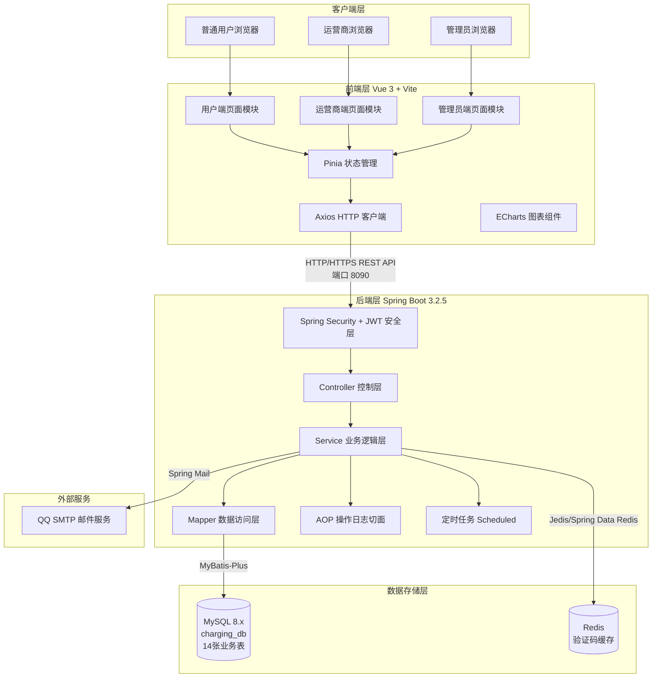
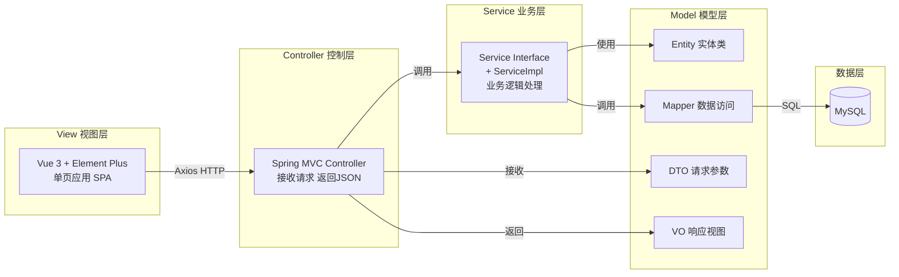
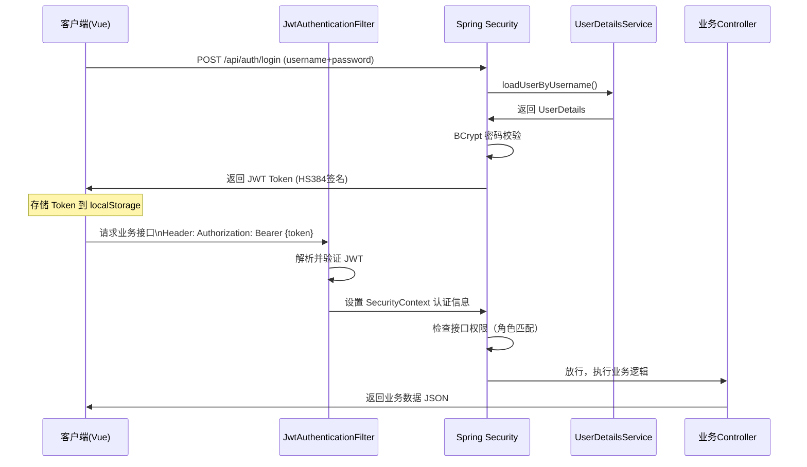
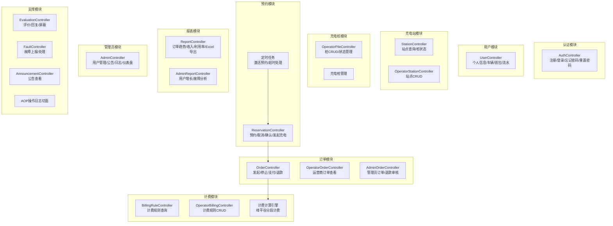
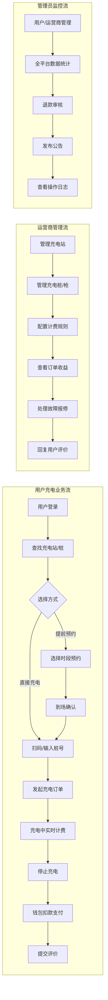
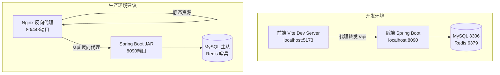

# 新能源汽车充电桩运营管理系统——系统架构文档

---

## 一、系统概述

本系统是一套面向新能源汽车充电服务场景的纯软件业务管理平台，采用前后端分离架构，覆盖充电桩日常运营全链路：用户注册与车辆绑定 → 查桩与预约 → 发起充电（模拟）→ 实时计费 → 订单结算与钱包支付 → 评价反馈 → 运营统计报表。

---

## 二、整体架构图



---

## 三、技术选型说明

### 3.1 后端技术栈

| 技术/框架 | 版本 | 用途说明 |
|-----------|------|----------|
| Spring Boot | 3.2.5 | 核心框架，提供自动配置、内嵌 Tomcat |
| Spring Security | 6.x | 认证与授权，接口权限控制 |
| MyBatis-Plus | 3.5.6 | ORM 框架，简化 CRUD，提供分页插件 |
| MySQL | 8.x | 关系型数据库，存储全部业务数据 |
| Redis | 6.x+ | 缓存中间件，存储邮箱验证码（TTL 5分钟） |
| JJWT | 0.12.6 | JWT 令牌生成与解析，实现无状态认证 |
| BCrypt | — | 密码单向加密，Spring Security 内置 |
| Apache POI | 5.2.5 | Excel 报表导出 |
| Spring Mail | — | 邮件发送，对接 QQ SMTP |
| Java | 21 | 运行环境 |
| Maven | 3.x | 项目构建与依赖管理 |

### 3.2 前端技术栈

| 技术/框架 | 版本 | 用途说明 |
|-----------|------|----------|
| Vue 3 | 3.x | 前端核心框架，Composition API |
| Vite | 5.x | 构建工具，开发服务器热更新 |
| Element Plus | 2.x | UI 组件库，表单/表格/弹窗等 |
| Pinia | 2.x | 状态管理，替代 Vuex |
| Axios | 1.x | HTTP 请求库，统一封装拦截器 |
| ECharts | 5.x | 数据可视化图表（折线图、柱状图、饼图） |
| Vue Router | 4.x | 前端路由，支持路由守卫权限控制 |

### 3.3 开发与部署环境

| 项目 | 说明 |
|------|------|
| 后端服务端口 | 8090 |
| 前端开发端口 | 5173 / 5174 |
| 数据库名 | charging_db |
| 数据库端口 | 3306 |
| Redis 端口 | 6379 |
| CORS 允许来源 | http://localhost:5173, http://localhost:5174 |

---

## 四、MVC 分层架构



### 分层职责说明

| 层次 | 对应实现 | 职责 |
|------|----------|------|
| View（视图层） | Vue 3 + Element Plus | 页面渲染、用户交互、数据展示 |
| Controller（控制层） | Spring MVC Controller | 接收前端请求、参数校验、调用 Service、统一返回 JSON |
| Service（业务层） | Service + ServiceImpl | 核心业务逻辑、事务管理、跨模块协调 |
| Mapper（数据层） | MyBatis-Plus Mapper | SQL 执行、数据库 CRUD 操作 |
| Entity/DTO/VO | POJO 类 | 数据封装：Entity 对应表结构，DTO 接收请求，VO 封装响应 |

---

## 五、安全认证架构

### 5.1 JWT 认证流程



### 5.2 权限控制矩阵

| 接口路径前缀 | 访问权限 | 说明 |
|-------------|---------|------|
| `/api/auth/**` | 公开（无需认证） | 注册、登录、忘记密码 |
| `/api/station/list`, `/api/station/{id}` | 公开 | 充电站查询 |
| `/api/billing/list/**` | 公开 | 计费规则查询 |
| `/api/announcement/list` | 公开 | 公告列表 |
| `/api/user/**` | USER / OPERATOR / ADMIN | 用户个人信息、车辆、钱包 |
| `/api/order/**` | USER | 充电订单操作 |
| `/api/reservation/**` | USER | 预约操作 |
| `/api/operator/**` | OPERATOR / ADMIN | 运营商管理功能 |
| `/api/admin/**` | ADMIN | 管理员专属功能 |

### 5.3 JWT Token 结构

```
Header:  { "alg": "HS384" }
Payload: { "sub": "userId", "username": "xxx", "role": "USER/OPERATOR/ADMIN", "iat": ..., "exp": ... }
Signature: HMACSHA384(base64(header) + "." + base64(payload), secretKey)
```

- Token 有效期：24 小时
- 存储方式：前端 localStorage
- 传递方式：HTTP Header `Authorization: Bearer {token}`

---

## 六、核心模块架构



---

## 七、数据流转架构



---

## 八、部署架构



---

## 九、项目目录结构

```
charging/
├── pom.xml                              # Maven 依赖配置
├── src/
│   ├── main/
│   │   ├── java/com/charging/
│   │   │   ├── ChargingApplication.java # 主启动类
│   │   │   ├── common/                  # 通用类
│   │   │   │   ├── exception/           # 业务异常 + 全局异常处理
│   │   │   │   └── result/Result.java   # 统一响应封装
│   │   │   ├── config/                  # 配置类
│   │   │   │   ├── SecurityConfig.java  # Spring Security + CORS
│   │   │   │   ├── JacksonConfig.java   # JSON 序列化
│   │   │   │   └── MybatisPlusConfig.java # 分页插件
│   │   │   ├── security/                # 安全模块
│   │   │   │   ├── filter/JwtAuthenticationFilter.java
│   │   │   │   ├── service/UserDetailsServiceImpl.java
│   │   │   │   └── util/JwtUtils.java
│   │   │   ├── aspect/                  # AOP 切面
│   │   │   │   └── OperationLogAspect.java
│   │   │   ├── controller/              # 18 个控制器
│   │   │   ├── service/                 # Service 接口 + impl
│   │   │   ├── mapper/                  # MyBatis-Plus Mapper
│   │   │   ├── entity/                  # 14 个实体类
│   │   │   ├── dto/                     # 请求参数 DTO
│   │   │   └── vo/                      # 响应视图 VO
│   │   └── resources/
│   │       ├── application.yml          # 主配置文件
│   │       └── sql/
│   │           ├── init.sql             # 建表脚本
│   │           ├── test_data.sql        # 测试数据
│   │           └── fix_test_data.sql    # 数据修复
│   └── test/                            # 单元测试
└── 文档/
    ├── 系统架构文档.md
    ├── 功能设计文档.md
    ├── 数据库设计文档.md
    └── API接口文档.md
```
